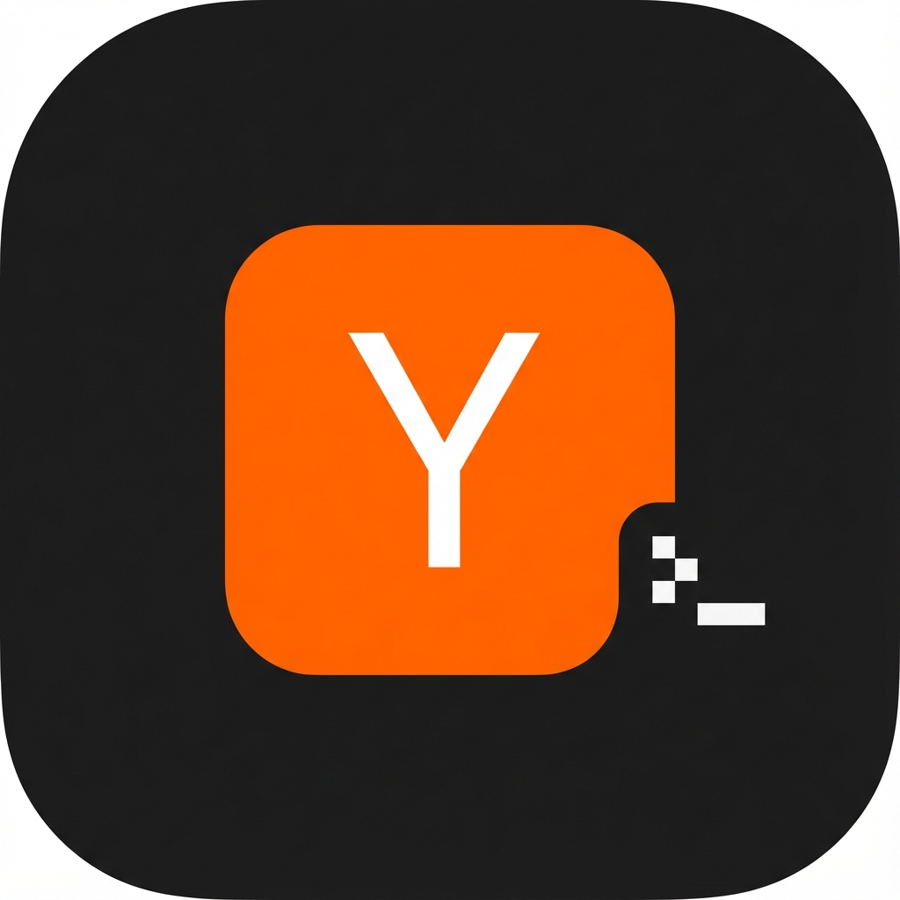

# HNEveryDay (极客版)

<p align="center">
  
</p>

**HNEveryDay** 是一款高性能、隐私优先、AI 增强的 iOS Hacker News 客户端，专为那些以终端为家、以代码为梦的极客们打造。

它结合了黑客们钟爱的信息密度与现代原生 iOS 应用的流畅触感体验。

---

## ✨ 功能特性

### 🚀 极致性能
- **120fps 滚动**：优化的 SwiftUI 列表，处理数千条目毫不掉帧
- **并行加载**：自定义网络层并发批量获取 Story 和评论，秒开

### 💬 深度讨论区
- **递归嵌套**：通过清晰的缩进可视化 HN 评论的深层嵌套
- **可折叠评论**：点击任意评论即可折叠整个子树
- **富文本渲染**：完整支持 HN HTML 评论（斜体、代码块、链接）

### 🤖 本地优先的 AI 智能
秒级获取"黑客视角"：
- **智能总结**：点击 ✨ 按钮，生成 **文章 + 热门讨论** 的精炼摘要
- **自带密钥**：无需订阅，使用您自己的 API Key
- **多服务商支持**：内置国内外主流模型预设：
  - 🇨🇳 **DeepSeek**（推荐，编程/技术场景最佳）
  - 🇨🇳 **通义千问 (Qwen)**
  - 🇨🇳 **智谱 ChatGLM**
  - 🇨🇳 **字节豆包**
  - 🇺🇸 **Gemini**（通过 OpenAI 兼容接口）
  - 🇺🇸 **OpenAI** (GPT-4o/mini)
  - 🏠 **本地部署**（支持 Ollama/LM Studio）

### 📖 原生智能阅读器 (v0.02)
- **无干扰模式**：移除广告、弹窗和杂乱内容
- **极客风格**：深色模式验证；代码块使用等宽字体并支持横向滚动
- **离线就绪**：自动缓存文章内容，地铁阅读无忧

### 🧠 知识引擎 (v0.02)
- **Markdown 导出**：一键生成格式化的研究笔记
- **深度上下文**：导出包含元数据、AI 摘要和精选评论，完美适配 Obsidian/Notion
- **阅读历史**：自动追踪已读内容（灰色链接标记）

### 🌏 国际化 (v0.03)
- **中文支持**：完整的简体中文 UI 本地化
- **上下文 AI**：系统语言为中文时，AI 自动以中文总结英文文章

### ⚙️ 统一设置 (v0.04)
- **一站式配置**：AI 服务商、语言偏好、缓存时长统一管理
- **引导页**：首次启动的欢迎界面展示核心功能

### 🔖 完善与优化 (v0.05)
- **收藏功能**：左滑保存文章，菜单筛选已收藏
- **钥匙串安全**：API 密钥存储于 iOS Keychain
- **骨架屏加载**：加载时的闪烁动画提升质感

---

## 🛠 技术栈

- **语言**：Swift 6
- **UI 框架**：SwiftUI (iOS 17+)
- **持久化**：**SwiftData** + 优化的"读穿"缓存策略
- **并发**：Swift 6 `async/await`，`Actor` 保证线程安全
- **状态管理**：MVVM + Observation 框架 (`@Observable`)
- **网络**：基于 `URLSession` 的自定义封装，对接 Hacker News Firebase API

---

## ⚙️ 配置说明

### 设置 AI 服务
1. 点击主界面的 **齿轮图标** (⚙️)
2. 选择 **服务商预设**（如 DeepSeek）
   - *应用会自动填充正确的 Base URL 和模型名称*
3. 粘贴您的 **API 密钥**
4. （可选）手动编辑模型名称以使用特定版本
5. 点击 **完成**，密钥安全存储于设备钥匙串中

---

## 📥 安装

1. 克隆仓库：
   ```bash
   git clone https://github.com/corlin/HNEveryDay.git
   ```
2. 使用 Xcode 15+ 打开 `HNEveryDay.xcodeproj`
3. 在 iPhone 或模拟器上构建运行

---

## 🤝 贡献

欢迎 PR！如果您想添加新的 AI 服务商预设或改进评论渲染引擎，请随时 Fork。

## 📄 许可证

MIT 许可证。Hacking is for everyone.
